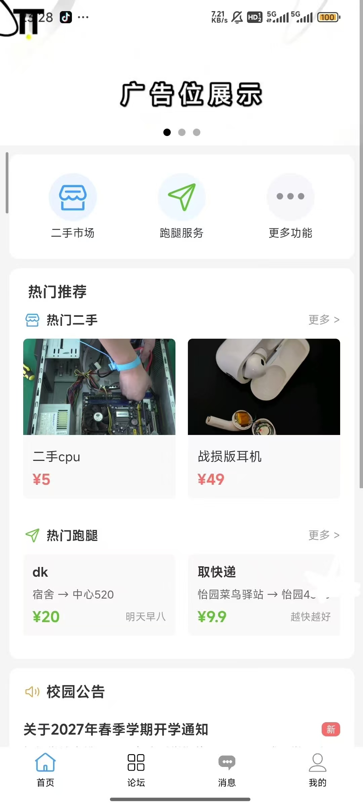
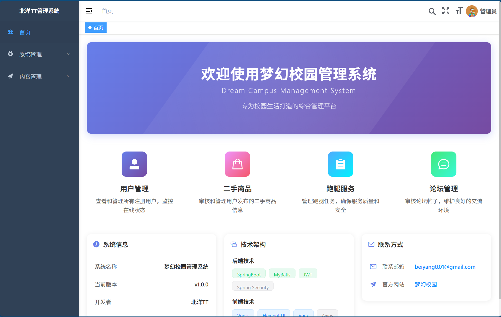

# 梦幻校园 (Dream Campus)

基于若依框架做的集二手、跑腿、论坛于一身移动版校园APP以及配套的网页版的后台管理系统（通过docker-compose一键部署）。

## 项目简介

梦幻校园是一个面向校园用户的综合服务平台，提供二手交易、跑腿服务、论坛交流等功能。项目采用前后端分离架构，移动端基于UniApp开发，支持H5、小程序、APP多端，后台管理系统基于Vue.js开发。

## 项目展示

### 移动端APP界面

<div align="center">
  
</div>

移动端提供以下核心功能：
- 二手市场：商品发布、浏览、搜索、分类筛选
- 跑腿服务：任务发布、接单、任务管理
- 论坛交流：帖子发布、评论、点赞
- 消息通知：系统消息、评论通知、聊天功能

### 后台管理系统界面

<div align="center">
  
</div>

后台管理系统提供完整的内容管理功能：
- 用户管理：查看和管理所有注册用户，监控在线状态
- 二手商品：审核和管理用户发布的二手商品信息
- 跑腿服务：管理跑腿任务，确保服务质量和安全
- 论坛管理：审核论坛帖子，维护良好的交流环境

## 技术架构

- **后端**：Spring Boot + MyBatis + MySQL + Redis
- **前端（移动端）**：UniApp + Vue.js
- **前端（后台）**：Vue.js + Element UI
- **部署**：Docker + Docker Compose

## 项目结构

```
├── RuoYi-App-master/          # 移动端前端项目（UniApp）
├── RuoYi-Vue-master/          # 后端项目 + PC管理后台前端
├── ruoyi-docker/              # Docker部署配置
├── Docker部署完整指南.md       # Docker部署详细说明
├── Sealos Cloud部署指南.md    # Sealos云平台部署指南
└── 项目分析报告.md            # 项目分析报告
```

## 快速开始

### 方式一：Docker Compose 一键部署（推荐）

详细部署说明请查看 [Docker部署完整指南.md](./Docker部署完整指南.md)

```bash
cd ruoyi-docker
docker-compose up -d --build
```

### 方式二：Sealos Cloud 云平台部署

详细部署说明请查看 [Sealos Cloud部署指南.md](./Sealos%20Cloud部署指南.md)

## 文档说明

- [Docker部署完整指南.md](./Docker部署完整指南.md) - Docker Compose 一键部署详细说明
- [Sealos Cloud部署指南.md](./Sealos%20Cloud部署指南.md) - Sealos云平台部署指南
- [项目分析报告.md](./项目分析报告.md) - 项目架构和功能分析

## 许可证

本项目基于若依框架开发，具体许可证请查看各子项目的 LICENSE 文件。
